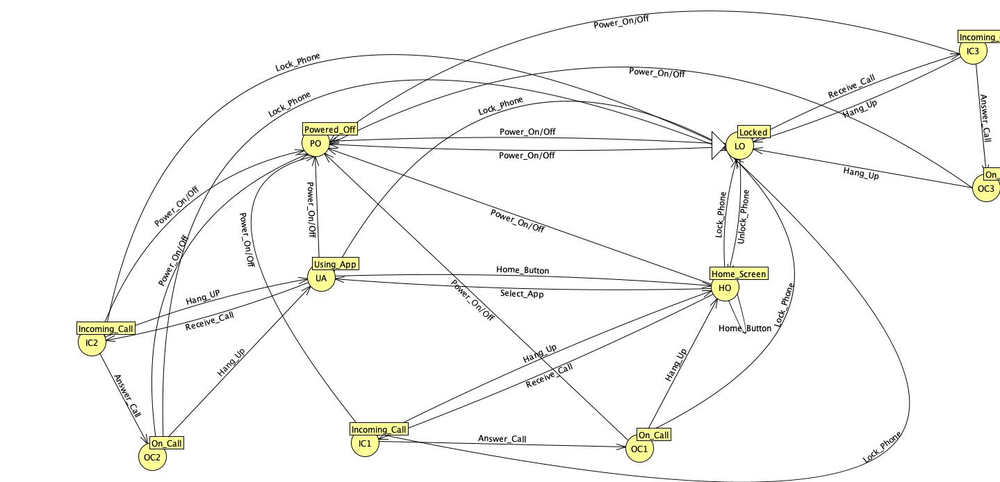

# simple-fsa-phone

This repository contains a simple **Finite State Automaton (FSA)** that models the behavior of a phone.
The project was created as a **school assignment** during the (id rememeber the year) year of high school** to practice the concept of finite state machines.

## Preview

## Description

The automaton represents basic phone states and the transitions between them, such as turning the phone on and off and switching between simple operational states.

## Purpose

- Understand finite state automata
- Apply theoretical concepts to a real-world example
- Practice basic modeling and documentation

## Notes

This is a simple educational project and does not aim to represent all real phone behaviors.

